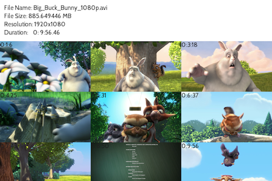
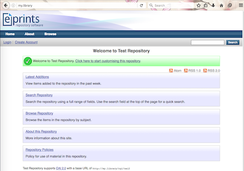
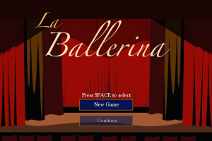

## AutoPick

Automatic photo gallery preview generator using machine learning

## pyVideoSheet

Python video thumbnail contact sheet creator

To download and use pyVideoSheet, also the documentation, please visit its GitHub page at https://github.com/rorasa/pyVideoSheet

##  EPrints-box and  EPrints-dock

_Support ended_

The vagrant box and the Docker container preconfigured to run EPrints repository system.

EPrints-box allows an institutional-grade repository system EPrints to be deployed instantly as a virtual machine. EPrints is a full-fledged respository system employed in hundreds on universities and libraries worldwide. With EPrints-box, it takes only a few steps to have your own powerful repository up-and-running locally in no time.

EPrints-box is designed to work as a local repository where large traffic and security are not concerns. It works best as a local repository, home repository or a demo. For large scale production repository, it is advised to deploy EPrints properly on a server following the instructions at http://wiki.eprints.org/w/Main_Page.

EPrints-box on [Github](https://github.com/rorasa/eprints-box/)

## Time's Up!

_Support ended_

A Chrome extension to limit the amount of time spent on social media.

## La Ballerina

A visual novel / music game hybrid entry to Indie Game Maker Contest 2013

To download La Ballerina, please visit its GitHub page at https://github.com/rorasa/la_ballerina
